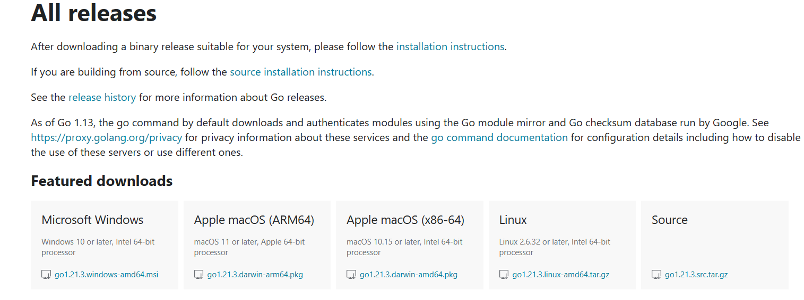

### [返回目录](../readme.md)
# 0.1 安装Go语言及搭建Go语言开发环境

## 0.1.1 下载
1. 访问 [`golang.google.cn/dl/`](https://golang.google.cn/dl/)
2. 根据操作系统选择对应文件下载
    

## 0.1.2 安装

+ ## windows下安装

  1. 将上一部选择好的安装包下载到本地
  2. 双击下载好的安装包，一直下一步即可
  3. 打开`powershell`，输入`go version`，若返回版本信息则说明成功安装
+ ## Linux or Mac 下安装
    请自行寻找安装方式

## 0.1.3 GOROOT和GOPATH
  `GOROOT`和`GOPATH`都是环境变量，其中`GOROOT`是我们安装go开发包的路径，而从Go 1.8版本开始，Go开发包在安装完成后会为`GOPATH`设置一个默认目录，并且在Go 1.14及之后的版本中启用了Go Module模式之后，不一定非要将代码写到GOPATH目录下，所以也就**不需要我们再自己配置GOPATH**了，使用默认的即可。
  <br />
  Go1.14版本之后，都推荐使用`go mod`模式来管理依赖环境了，也不再强制我们把代码必须写在GOPATH下面的src目录了，你可以在你电脑的任意位置编写go代码。

## 0.1.4 GOPROXY
  GOPROXY的默认配置是`GOPROXY=https://proxy.golang.org,direct`，由于中国大陆地区访问不到`https://proxy.golang.org`，所以我们需要换一个proxy,这里我们推荐`https://goproxy.io`或者`https://goproxy.cn`

  执行下列命令修改`GOPROXY`
  ```shell
  go env -w GOPROXY=goproxy.cn,direct
  ```

## 0.1.5 编辑器的选择
+ VS Code

  安装`go`扩展插件
+ GoLand
  强大好用的go IDE

### 到这里，我们go的环境就安装完成了